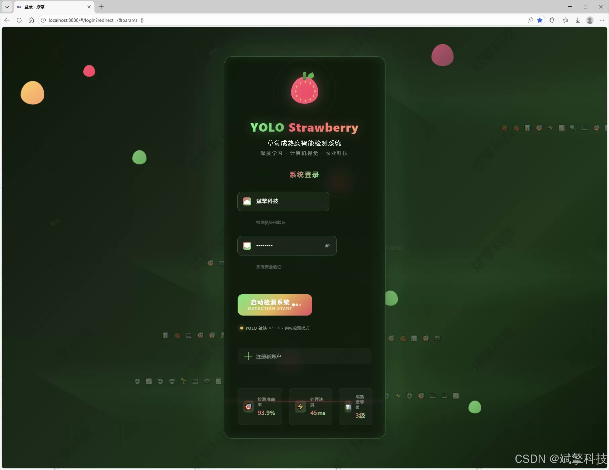
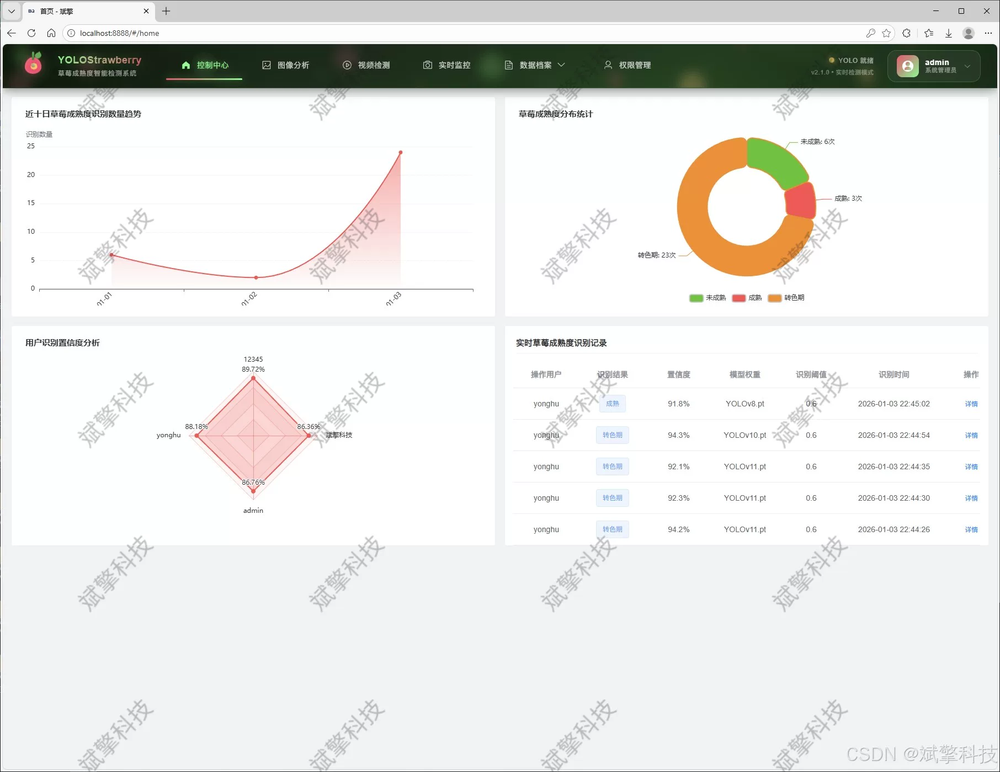
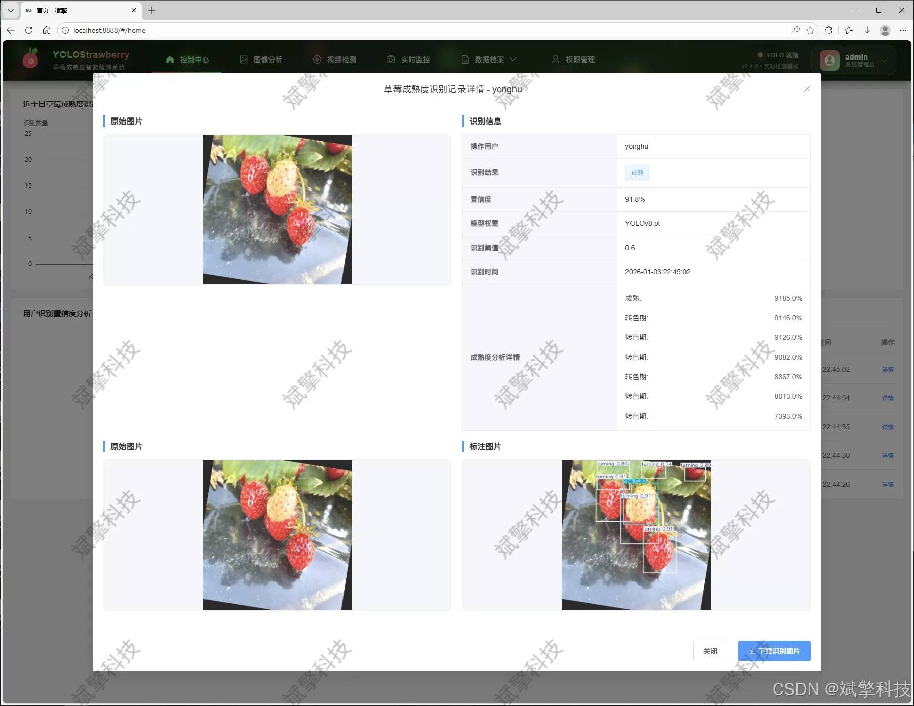
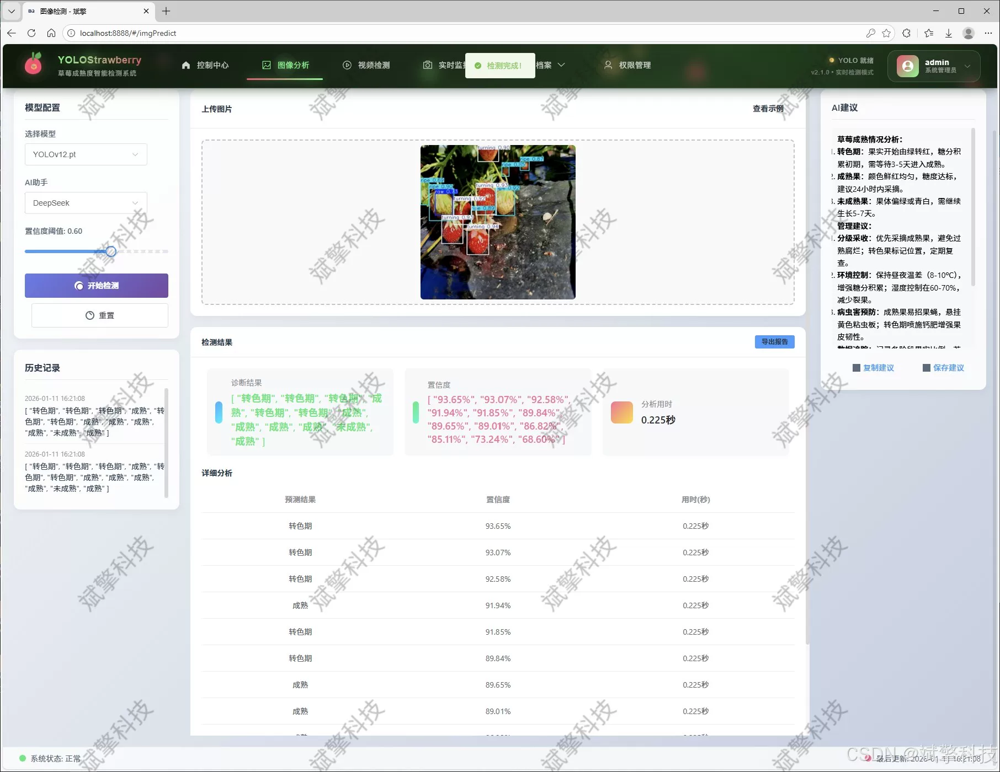
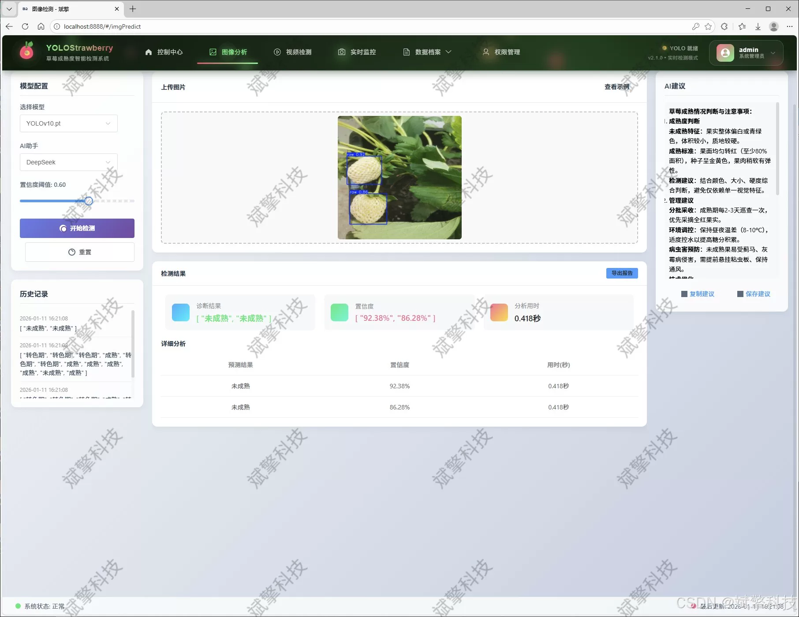
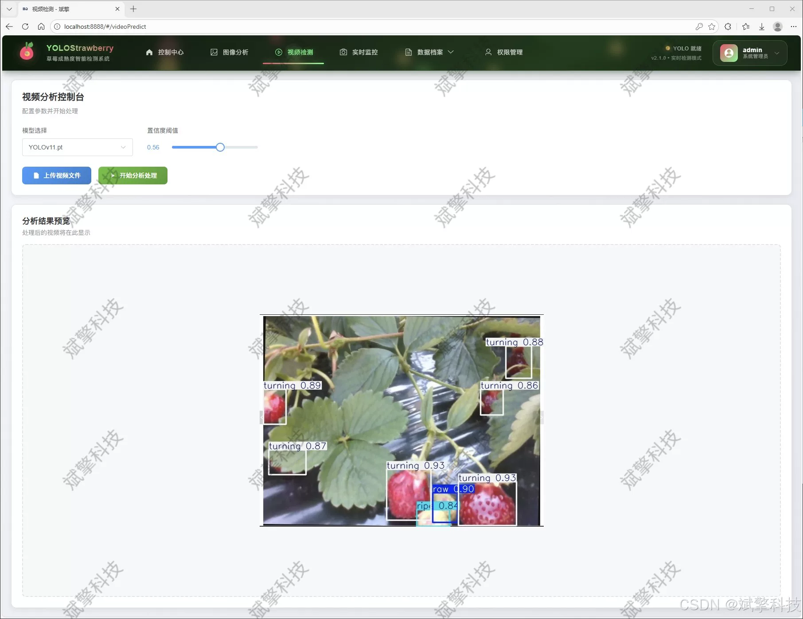
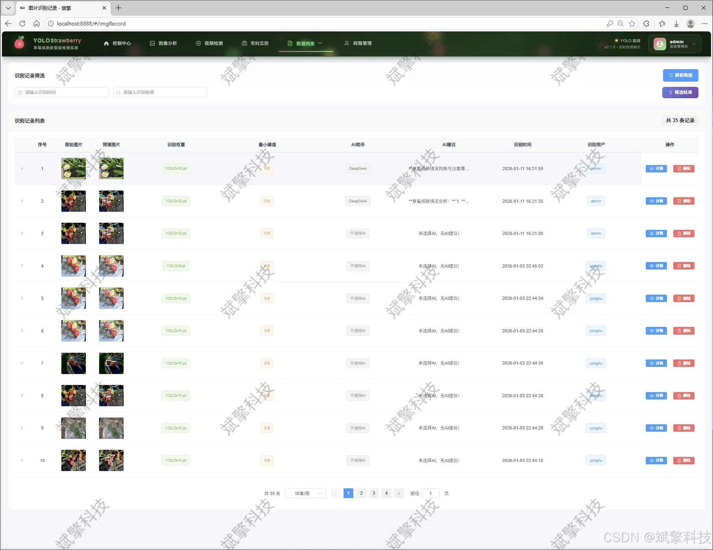
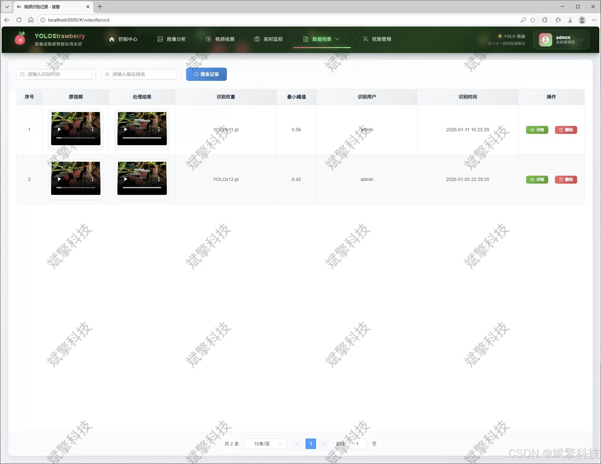
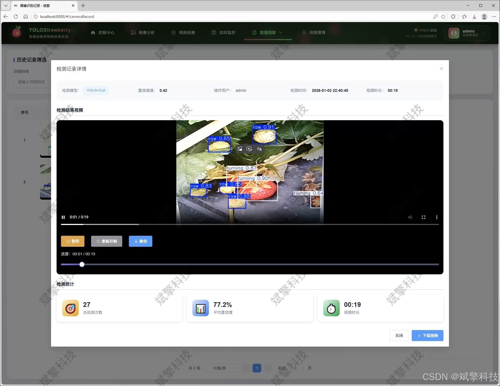

# Based on YOLO deep learning and the big models of Qianwen and DeepSeek, the ripeness of strawberry

## Body

Based on YOLO deep learning and the large models of Qianwen, DeepSeek intelligent analysis system for strawberry maturity detection (DeepSeek intelligent analysis + web interface + front-end separation + YOLO data + YOLOv8/YOLOv10/YOLOv11/YOLOv12)

This project has been designed and implemented a high-efficiency, precise, user-friendly intelligent strawberry maturity detection and analysis system. The system deeply integrates the current cutting-edge deep learning object detection technology with modern web application development frameworks, aiming to solve the core pain points in agricultural production that rely on manual human judgment for strawberry picking stages and are inefficient and unstandardized.

The core detection module of the system adopts the YOLO series model based on PyTorch (including YOLOv8, YOLOv10, YOLOv11, and YOLOv12), which is trained on a dataset containing 3,713 high-quality labeled images (2,939 training set, 774 validation set). The model can accurately identify three key maturity states of strawberries: immature, ripening, and fully ripe. This module provides three flexible application modes: image upload detection, video stream analysis, and real-time camera detection, meeting the detection needs in different scenarios.

To enhance the level of intelligence of the system, this project innovatively integrates the intelligent analysis function of the DeepSeek large language model. After completing the visual detection, the system can send the detection results to the DeepSeek API to obtain reports about fruit growth status, recommended picking priority, and insightful analysis reports, achieving a leap from "perception" to "cognition".

The backend of the system is built using SpringBoot framework, adhering to the architecture concept of front-end separation, ensuring high cohesion, low coupling, and good maintainability. The front end is designed with an intuitive web interface, providing users with a smooth operation experience. The data persistence layer uses MySQL database, not only stably storing critical information such as user accounts, detection history, and model configuration but also realizing multidimensional visualization of detection data through charts, assisting users in decision-making analysis.

The system has a complete user system, including user registration and login (including password security check), personal center information management, and administrator back-end (supporting user management, recognition record management, etc.). All detection operations by users are recorded and traceable, forming a closed loop process from data input, intelligent analysis to result management.

Functional modules

✅ User login and registration: Support password checking, saved to MySQL database.

✅ Support four YOLO models switching, YOLOv8, YOLOv10, YOLOv11, YOLOv12.

✅ Information visualization, data visualization.

✅ Image detection support AI analysis function, deepseek and Qianwen.

✅ Support image detection, video detection, and real-time camera detection, detection results saved to MySQL database.

✅ Image recognition record management, video recognition record management, and camera recognition record management.

✅ User management module, administrator can add, delete, update, and view users.

✅ Personal center, you can modify your own information, password name profile picture and so on.

## Images

## Payment

Here is a pay link on Stripe ( https://buy.stripe.com/3cs8yP7sY87d0vu9AB ). Please contact me lonlonago@foxmail.com after funding $89, and I will send you a complete data files , thank you!

